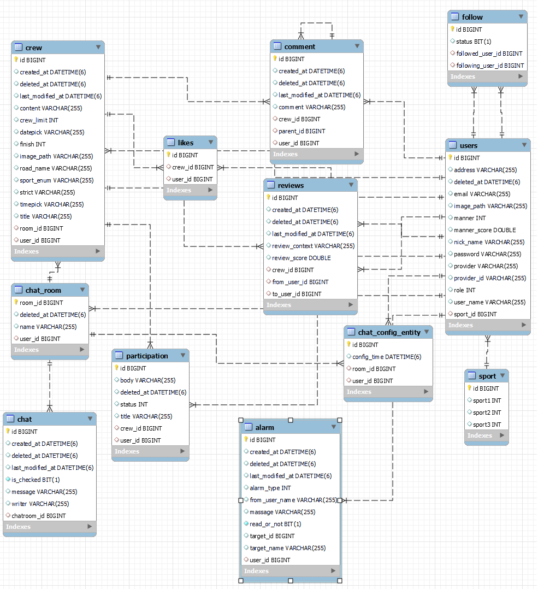

# 오늘부터 운동메💪

* **멋쟁이사자처럼🦁 백엔드스쿨 2기 팀프로젝트**

##### 
 "동네 운동 메이트를 찾아 함께 스포츠를 즐기는 서비스" 

## 🤾‍ 프로젝트 시연 영상

<a href="https://www.youtube.com/watch?v=VC1-2shIez8">오늘부터 운동메💪 시연 영상</a>

 

## 🏋️‍♀️ 개발 환경

* **에디터** : Intellij Ultimate
* **개발 툴** : SpringBoot 2.7.7
* **자바** : JAVA 11
* **빌드** : Gradle
* **서버** : AWS EC2, AWS RDS, AWS S3
* **CI/CD** : Docker, Gitlab
* **데이터베이스** : MySql, Redis
* **필수 라이브러리** : Spring Data JPA, Lombok, Spring Security, thymeleaf, JWT, WebSocket, OAuth2.0, Email
* **ETC** : Git, IntelliJ, JS, KakaoMap API

## 🚴‍♀️ 시스템 아키텍쳐

## 🤸‍♀ ERD

 

## 🏄‍♂ 직접 구현한 기능

#### USER

- [x] **로그인**
    * ID/PW 이용한 기본 로그인 기능
    * OAuth 로그인 (구글 로그인 기능)
    * JWT를 쿠키에 담아 인증, 인가처리 진행
- [x] **회원가입**
    * 이메일 인증을 통한 기본 회원 가입 (ID, PW, Email, 이름, 주소 등)
    * OAuth 회원가입 (구글 회원가입 기능)
- [x] **ID/PW 찾기**
  - 가입한 이메일을 통해서 인증번호가 발송되며, 인증됨에 따라 PW 변경 가능

#### CREW

- [x] **크루 CRUD 기능**
    - 지역별, 카테고리별 데이터를 유지하면서 원하는 게시글 조회
    - 검색어를 유지하면서 페이징 처리 기능
    - 회원에 한해서 작성 가능
    - 작성자만 수정, 삭제 가능
- [x] **크루 댓글/대댓글**
  - 댓글, 대댓글 CRUD 기능
   - 회원 한해서 작성 가능
   - 작성자 한해서 수정, 삭제 가능

#### ALARM

- [x] **알림 기능**
    - SSE를 통한 알림 기능 구현
    - 댓글, 대댓글, 좋아요, 팔로우, 참여 신청 및 승인, 이용자 후기, 실시간 매칭에 대한 알림이 발생

#### MATCHING

- [x] **실시간 매칭기능**
    - 운동 종목별 실시간 매칭 기능
    - 매칭 성공 이후 알림처리하여 채팅방 이동 기능

# 🎯 Refectoring

실시간 매칭, 실시간 알림 기능을 리펙토링 하였습니다.   
해당 레포지토리에 오시면 필수로 살펴보셔야 할 포인트입니다!  

[리펙토링 PR](https://github.com/ReadnThink/pocoapoco-refectoring/pulls?q=is%3Apr+is%3Aclosed)  
 
처음 개발을 시작하고 만들었던 기능이기에 코드의 가독성이 없고  
효율적이지 못하였습니다.  
 
팀 프로젝트 이후 도메인 주도 개발, 클린코드, 모던 자바 인 액션, Object, 개구리책, 자바의 신 등을 읽고 
기본기를 채웠습니다.
 

## Refectoring 포인트

### 실시간 매칭
[실시간 매칭 핵심 코드 리펙토링 -> LiveMatchServive가 핵심로직입니다.](https://github.com/ReadnThink/pocoapoco-refectoring/pull/5)

- 모던 자바 인 액션을 읽고 람다, 스트림을 적용하여 리펙토링
    - **약 50% 감소 (268줄 → 137줄)**
      
### 실시간 알림

[refector : SSE알림 Static 전환하여 재사용](https://github.com/ReadnThink/pocoapoco-refectoring/pull/1)  
[refector : SSE static -> Strategy Pattern](https://github.com/ReadnThink/pocoapoco-refectoring/pull/2)  
[refector : Sse Strategy pattern -> Bean으로 관리](https://github.com/ReadnThink/pocoapoco-refectoring/pull/4)  

- 중복되는 SSE 로직을 개선  
Static → Strategy Pattern → Bean 으로 리펙토링  
중복을 줄이고 하드코딩을 Enum으로 변경하여 코드의 가독성 증가  

 

# 👩‍🦯 배운점

# **Redis를 이용한 실시간 매칭기능 구현**

Redis SortedSet을 이용해 **매칭큐**를 만들어 카테고리별 참여자들에게 랜덤 매칭 기능 제공

## 실시간 매칭 Flows

## **Redis의 sortedSet을 사용한 이유**

**sortedSet은** Set 자료구조이면서 score에 따라 순서를 보장할 수 있습니다.   
중복되는 요청이 들어오면 값을 덮어쓰기 때문에 **O(1)**의 시간복잡도로 해결할 수 있습니다.   

시간복잡도 : **O(n) → O(1)**

# SSE를 통한 사용자에게 실시간 알림 처리

알림이 발생하면 알림 서비스 구현 방법에 대해 polling, web socket, SSE중 어떤 것을사용할지에 대해 고민하였습니다.  
알림은 사용자에게 단방향으로 진행되며, web socket과 같이 양방향성 로직은 오버스택이고 polling은 지속적으로 서버에 부하가 가기 때문에 단방향인 SSE를 사용하였습니다. 

# Oauth 로그인

Template Method 패턴을 적용해 다양한 플랫폼의 로그인 기능이 추가되어도 유지보수가 가능한 코드를 작성하였습니다.

# 알림 읽음/ 안읽음 구분

알림 메시지에 대한 읽음/안읽음 구분하여 알림을 구분 할 수 있게 처리하였습니다.

Front 부분에서 Thymeleaf문법을 통해 읽음/안읽음 알림을 확인하고 배치하였습니다.

## 🦁 ETC

